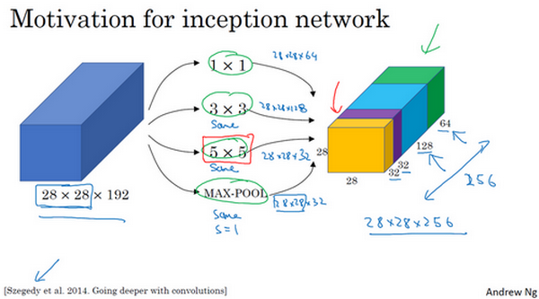
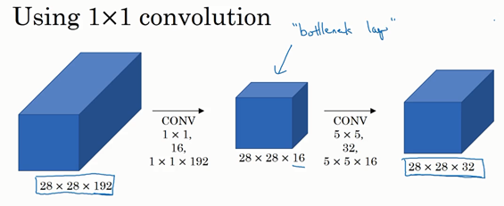
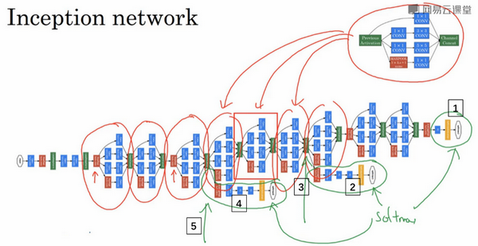

## 卷积神经网络

#### 卷积神经网络

##### 卷积层

###### 过滤器

* f-size：

  * 通常为奇数
    * 方便对称填充
    * 有中心像素点，方便指出过滤器的位置

* 意义和理解

  * 使用不同filter检测方向的边缘

    * 水平边缘

      

    * 竖直边缘

      

* 不同边缘

  * 边缘两边明暗的不同对检测结果的影响（filter进行对称变换也会产生相同作用）

    * 暗-亮-暗

      

    * 亮-暗-亮

      

  * filter计算后取绝对值-不关注边界两边的明暗的不同

* 不同filter

  * Sobel过滤器

    * 特点：增加了中间一行的权重

      如
      $$
      \begin{bmatrix}
        1&0&-1\\
        2&0&-2\\
        1&0&-1
      \end{bmatrix}
      $$

    * 效果：结果鲁棒性更好

  * Scharr过滤器：略

  * 学习filter权重：

    * 将权重设置为参数，使神经网络来自动学习他们，通过学习权重来得到检测各种边缘的权重值。

    * 如
      $$
      \begin{bmatrix}
        w_1&w_2&w_3\\
        w_4&w_5&w_6\\
        w_7&w_8&w_9
      \end{bmatrix}
      $$

  * 三维filter：

    * 根据需要设置不同channel的权重大小

    * 如：为了检测红色通道的垂直边缘，filter设置

      channel1：
      $$
      \begin{bmatrix}
        1&0&-1\\
        1&0&-1\\
        1&0&-1
      \end{bmatrix}
      $$
      

      channel2和channel3全部设置为0

###### Padding

* 方法
  * Same：使用padding并且保持卷积后H、W与卷积前一致
  * Valid：不使用padding
* 使用原因
  * 只是简单用filter进行卷积会出现以下问题
    * 每次padding之后图像会缩小
    * 丢失了图像边缘位置的信息

###### stride

* 商不是整数的情况：
  * 向下取整
  * 你只在蓝框完全包括在图像或填充完的图像内部时，才对它进行运算。如果有任意一个蓝框移动到了外面，那你就不要进行相乘操作

###### 卷积层整体

* 多个filter：
  * 方便同时检测不同的内容：如不同角度的边缘
* 计算整体步骤：
  * 非线性激活函数(对应field*filter+偏差) 
  * 偏差b：每一个filter对应一个值
* 表示
  * f[l]：第l层的filter大小
  * p[l]：第l层的padding的数量/valid/same
  * s[l]：第l层的stride
  * 输入：n/h[l-1]&times;n/w[l-1]&times;nc[l-1]     &rarr; 输出：n/h[l]&times;n/w[l]&times;nc[l]
* 特点（相对于全连接）
  * 参数少
  * 参数共享
  * 稀疏连接每个输出只和对应的field连接
* 优点
  * 防止过拟合
  * 善于捕捉平移不变

##### 池化层pooling

* 作用：
  * 缩减模型大小
  * 提高计算速度
  * 提高所提取特征的鲁棒性
* 类型：
  * 最大值：常用
  * 平均值：少用
* 理解：
  * 提取主要特征：如maxpool，看每个区域是否检测到了某个特征，如眼睛或边缘，如果检测到了就会有较大的值，maxpool会将这个值提取出
* 有时候间隔池化层作为一个单独的层，有时候conv+pooling整体作为一层

#### 深度卷积神经网络

##### 经典网络

###### LeNet-5

* 构造

  

  池化层后面使用了sigmoid函数

* 特点

  * 没有用padding
  * 总是用valid卷积
  * 参数数量：约6万个

* 论文阅读建议

  * 精度第二段，泛读第三段

###### AlexNet

* 构造

  

* 特点

  * AlexNet能够处理非常相似的基本构造模块，这些模块往往包含着大量的隐藏单元或数据，这一点AlexNet表现出色。
  * 相对LeNet表现更加出色  &larr;  使用了ReLu激活函数

* 论文

  * 使用两个GPU训练

  * *局部响应归一化层（Local Response Normalization/LRN）*：

    * 基本思路

      假如这是网络的一块，比如是13×13×256，LRN要做的就是选取一个位置，比如说这样一个位置，从这个位置穿过整个通道，能得到256个数字，并进行归一化。

    * 动机：对于这张13×13的图像中的每个位置来说，我们可能并不需要太多的高激活神经元。

    * 不常用

###### VGG-16

* 构造

  

* 特点

  * 16：在这个网络中包含16个卷积层和全连接层
  * 卷积层filter数量变化存在一定的规律：64&rarr;128&rarr;256&rarr;512
  * 每次池化后图像大小(H and W)减半，层数翻倍
  * 需要训练的特征数量巨大：包含约1.38亿个参数

* VGG-19

  * 比VGG-16更大
  * 效果差不多

##### ResNets

* 由 *残差块(Residual block)* 构成

  * 
  * a[l+2]=g(z[l+2]+a[l])
  * *跳跃连接* ：a[l]跳过一层/多层，从而将信息传递到神经网络的更深层

* 整体构造

  * 

    每两层增加亿个捷径，构成一个残差块；5个残差块连在一起构成一个残差网络。

  * 

  * 常用结构：(卷积层-卷积层-卷积层-池化层) &times; n - softmax全连接层进行预测

  * 细节：由于使用了残差，需要保持维度一致 &rarr;使用了很多的same卷积

* 优点：

  * 用普通网络（没有残差），随着神经网络的加深，效果会先变好再变差；

    而使用残差，网络越深效果越好

    

* 理解
  
  * 恒等式函数？？？

##### 1 &times; 1 卷积/Network in Network

* 理解
  * 对同一个位置上所有channel的值进行全连接
* 意义
  * 压缩通道数量（对比池化：压缩H和W）
  * 增加非线性函数，使得网络可以学习更复杂的函数，但保持通道数量不变
  * 通道数量增加

##### Inception

* 意义

  * 代替决定某层要使用的操作（如filter选择3/5）

  * 不用人为决定是否需要池化或者使用哪种过滤器，而是由网络自行确定这些参数，给网络添加这些参数所有的可能，输出连接起来，让网络自己学习需要什么样的参数/过滤器的组合

    

* 缺点与改进

  * 计算成本极高

  * 使用*瓶颈层*

    

    使用 1&times;1 卷积来压缩，然后放大（当合理构建时时，不会有多少的信息损失why???）

  * 改进后

    

    maxpool后使用1&times;1网络是为了压缩对应通道数，避免maxpool占用通道过多（maxpool不改变channel数量）

* 整体构造

  

  中间和隐藏层也能预测图片，起到调整作用，防止过拟合

##### 开源和迁移学习

* Github中寻找开源的有关网络代码

  * ResNets：[*https://github.com/KaimingHe/deep-residual-networks*](https://github.com/KaimingHe/deep-residual-networks)

* 迁移学习

  * Github上下载有关已经训练好的模型，借用训练自己的模型

  * 根据现有训练数据的数量确定训练方式：

    如

    * 当数据量很少时，只训练最后softmax的参数，前面参数固定
    * 当数据量多一些时，训练的部分可以向前拓展，使得更多参数进行训练

  * 训练技巧：先使得要训练的数据计算经过固定的部分，记录得到的数据，然后只看后面部分进行训练

  * 常用参数：trainableParameter=0 / freeze=1

##### 数据增强

* 常用方法：
  * 裁剪：可能会得到难以辨别的图片
  * 镜像对称
  * 旋转
  * 扭曲变形
  * 色彩变换：
    * 给R、G、B三个通道加上不同程度的失真值  &rarr;  鲁棒性更好
    * PCA主成分分析
* 数据增强中的超参数
  * 裁剪的参数，色彩变换的参数等等都是超参数，要调整

##### 计算机视觉现状

* 集成学习

  * 同时独立用多个不同网络训练，平均输出

* multi-crop

  * 将裁剪运用到测试集中

  * 如：10-crop

    

    这是这里（编号1）和这里（编号3）就是中心crop，这里（编号2）和这里（编号4）就是四个角落的crop。如果把这些加起来，就会有10种不同的图像的crop，因此命名为10-crop。所以你要做的就是，通过你的分类器来运行这十张图片，然后对结果进行平均

#### 目标检测

##### 目标定位

* 内容

  * 定位分类问题
  * 判断图片是否含某个对象+在图片中标记出对象的位置

* 目标标签：

  * $$
    y=\begin{bmatrix}
      p_c\\b_x\\b_y\\b_h\\b_w\\c_1\\c_2\\c_3\\
    \end{bmatrix}
    $$

  * pc：包含对象为1，否则为0

    bx+by：对象框中心点的位置（相对于图片而言，在[0,1]内）

    bh+bw：对象框的长和宽（相对于图片而言，在[0,1]内）

    c1+c2+c3：属于哪一类对象，对应的下标就为1，其他为0

  * 如果pc为0，后面的都不重要了，可以用？表示

* 损失函数

  * 对于pc为1时，损失函数是向量后面项的平方和
  * 对于pc为0时，损失函数只考虑pc，差的平方
  * 

##### 特征点检测

* 应用
  * 检测面部笑脸：通过眼睛上的某些特征点（如：内/外眼角）或嘴上的特征点（如嘴角位置的变化）检测
  * 运动分析：对于人的身躯，找出某几个特征点，来分析人的运动
  * 特征点：(l1x, l1y), (l2x, l2y)...

##### 目标检测

###### 滑动窗口

* 基本思想

  * 选择特定大小的窗口，让窗口按照顺序在测试图片中滑动，直到完成，每滑动一次就判断框中的图像中有没有要检测的目标。
  * 如果某个窗口大小没有检测到，则改变大小重复检测
  * 

* 缺点

  * 计算成本高
  * 目标不一定是方形的/不一定可以很好的被方框标出，边框不够准确

* 计算效率提升-卷积

  * 将FC层变为卷积层：

    输入n1个神经元 &rarr; 输出n2个神经元  可以看作  1&times;1&times;n1 &rarr; 1&times;1&times;n2

    

  * FC转换成卷积层之后，对于整体同时进行卷积，得到的结果不同位置的值代表窗口在对应位置得到的值

    

###### Bounding Box — YOLO

* 基本思想  没太看明白，整合起来怎么定位？

  * 将检测图像划分为多/9个方框，在每个方框内对于目标进行检测

    * 对于不同方框检测到同一个目标对象，计算出不同方框检测到的对象中点对应的总中点，总中点属于某个格子，此对象就属于某个格子

      

    * 每个格子会得到八维输出，即
      $$
      y=\begin{bmatrix}
        p_c\\b_x\\b_y\\b_h\\b_w\\c_1\\c_2\\c_3\\
      \end{bmatrix}
      $$
      注意：坐标值仍然为比例（相对每一个小格子位置的比例），在0-1之间

    * 计算：（注意输出为8维）和滑动窗口的改进一样，一次卷积计算即可

* 评价：

  * 可以精确输出边界框 how???
  * 格子数量越多，越能够避免多个对象分到同一个格子的情况

* **非极大值抑制**
  * 意义
    * 确保每个对象只检测出一次（本来算法有可能多次检出）
  * 方法
    * 对于检测n个对象：
      * 首先找出p最大的框高亮
      * 计算其他框和最大的框的IoU，然后删除IoU大的预测框
      * 找下一个p最大的框，重复以上步骤n次

* **Anchor Boxes**(how???)
  * 意义：
    * 用于处理同一个格子内分配了多个对象的情况
  * 方法 没看懂

###### 交并比IoU

* 定义
  * 两个边框的交际和并集之比
  * 
* 意义：计算预测器和实际边界框的IoU来判断预测器的预测效果
  * 一般IoU &ge; 0.5就认为预测结果可以接受（可以设定为更高的值域）

###### 候选区域

* 目的
  * 为了减小不必要位置检测所产生的浪费，先对于图像进行简单处理，找出可能存在对象的地方
* 方法
  * 图像分割算法：图像&rarr;色块&rarr;选择边框&rarr;在色块上运行分类器
  * 
* 算法与评价
  * R-CNN：很慢
  * Fast R-CNN
  * Faster R-CNN
  * 基本都还是比YOLO慢得多

#### 特殊应用

##### 人脸识别

###### 活人

* 判断被检测对象是否是活人，防止出现照片冒充的情况

###### 人脸验证和人脸识别

* 人脸验证：
  * 输入某张图片、某人的ID/名字，系统判断图片是否是这个人
  * 一对一问题
* 人脸识别
  * 一对多问题，难很多
  * 要求较高的正确率，eg 99.9%

###### One-shot 学习

* 人脸识别思路

  * 思路一：对于n个人的判别，每一个识别图片输出一个(n+1)维向量，分别表示每一个人和所有都不是
    * 由于训练数据集小（往往每个人的图片只有一张），效果差
    * 再加入人员时需要重新更改并训练网络
  * 思路二（one-shot）：训练一个Similarity函数，比对识别图片和数据库中每一个对象的差异值，为同一个人差异值小，为不同人差异值大

* 相异性的衡量-Siamese网络

  * 在fc处比较不同的输入图像得到的两个向量的欧几里得距离来衡量相异性
  * 

* 损失函数-Triplet损失

  * 训练图像：三个一组对应一个对象-Anchor(标准, A)  Positive(相同对象, P)  Negative(不同对象, N)

  * 直接目标：
    $$
    ||f(A)-f(P)||^2\leq||f(A)-f(N)||^2
    $$

  * 转换后目标：
    $$
    ||f(A)-f(P)||^2-||f(A)-f(N)||^2+a\leq0, a\geq0
    $$
    

    * a是为了防止神经网络输出全部相同/为0的情况出现。
    * a的大小可调整，代表着网络判断的可靠性
    * 一般a至少为0.2

  * 最终损失函数
    $$
    L(A,P,N)=max(||f(A)-f(P)||^2-||f(A)-f(N)||^2+a, 0)\\
    J=\sum_{i=1}^nL(A^{(i)},P^{(i)},N^{(i)})
    $$

  * 注意：输入图像A P N本身的选择对网络的训练效果很重要，所以N最好选择和A相似的图像，而不是差距较大的

    eg: 

* 其他相似性的衡量方法

  * 通过神经网络：将两个图像得到的fc层输出编码作为输入，输入到下一个逻辑回归单元中，输出预测判断，同一个人为1，不同人为0

  * 

  * $$
    或\\
    \hat{y}=\sigma(\sum_{k=1}^{n}w_i\frac{(f(x^{(i)})_k-f(x^{(j)})_k)^2}{f(x^{(i)})_k+f(x^{(j)})_k}+b)\\
    $$

  * Tip：在使用时，可以提前对数据集中的人像进行训练计算，得到编码，储存编码方便未来直接使用

##### 风格迁移

###### CNN特征可视化理解

* 探究CNN究竟在学什么：找到使得单元激活最大化的图片块，可以反应不同层的神经单元学习内容的变化
  *     layer 1 + layer2
  * layer3
  * layer4
  * layer5
  * 可以看出layer1在学习一些线条边界，layer2学习一些特征形状，后面随着层数的加深，学习的内容逐渐变大

###### 迁移学习的代价函数

* 基本思路

  * 主要三个对象： 内容图像C   风格图像S   生成图像G

  * 判断生成图像的好坏：

    * 内容代价：衡量G与C的相似性
      $$
      J_{content}(C,G)
      $$
      
    
    * 风格代价：衡量G与S的相似性
      $$
      J_{style}(S,G)
      $$
      
    
    * 总代价
      $$
      J_{G}=\alpha J_{content}(C,G)+\beta J_{style}(S,G)
      $$

* 内容代价函数的确定

  * $$
    J_{content}(C,G)=\frac{1}{2}||a^{[l][C]}-a^{[l][G]}||^2
    $$

  * l的选择：不能太大，也不能太小，一般选择中间层

  * 理解：根据前面的CNN学习的特征的理解，当l较小的学习的区域较小、内容较少，选择中间层即是那些学习到了关键特征的神经元，所以2-范数衡量了G是否生成了关键要素

* 风格代价函数的确定

  * $$
    G_{kk'}^{[l](S)}=\sum^{n_H^{[l]}}_{i=1}\sum^{n_W^{[l]}}_{i=1}a^{[l](S)}_{(i,j,k)}a^{[l](S)}_{(i,j,k')} \\
    G_{kk'}^{[l](G)}=\sum^{n_H^{[l]}}_{i=1}\sum^{n_W^{[l]}}_{i=1}a^{[l](G)}_{(i,j,k)}a^{[l](G)}_{(i,j,k')} \\
    J_{style}^{[l]}(S,G)=\frac{1}{(2n_H^{[l]}n_W^{[l]}n_C^{[l]})^2}\sum_k\sum_{k'}(G_{kk'}^{[l](S)}-G_{kk'}^{[l](G)})\\
J_{style}(S,G)=\sum_{l}\lambda^{[l]}J_{style}^{[l]}(S,G)
    $$
    
  * 理解：
  
    * G-Gram Matrix：衡量一个图像的风格，反应某层神经元中不同channel之间的协方差，如第一层channel检测的橙色，第二层channel检测的是竖直边界，对应Gram矩阵就可以判断衡量是否竖直边界是橙色
    * Jstyle[l]-第l层的风格代价：生成图像与风格图像中Gram Matrix的差距
    * 总代价：所有层的风格代价之和

##### 卷积神经网络在一维到三维的拓展

###### 一维

* 如心电图

  

* 输入1&times;n1 + 过滤器 1&times;n2(n3个) &rarr; 1&times;(n1-n2+1)&times;n3

###### 三维

* 如人体的CT扫描结果

  

* 输入n1&times;n2&times;n3 + 过滤器 n'1&times;n'2&times;n'3(n4个) &rarr; 4-dimension output

